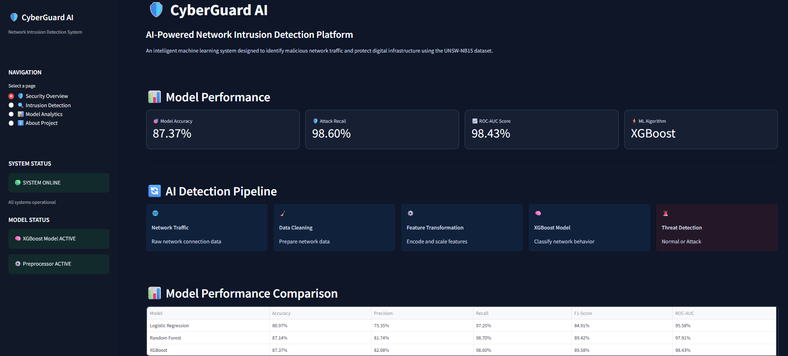
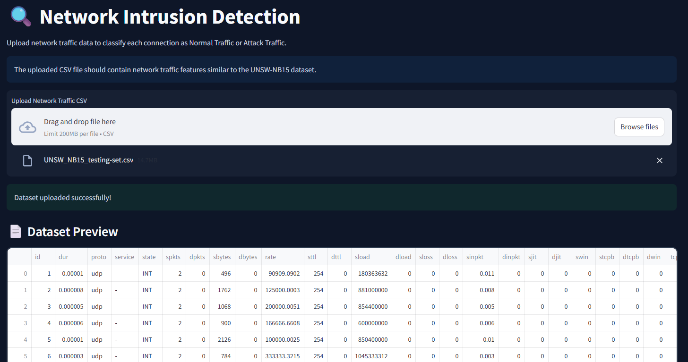
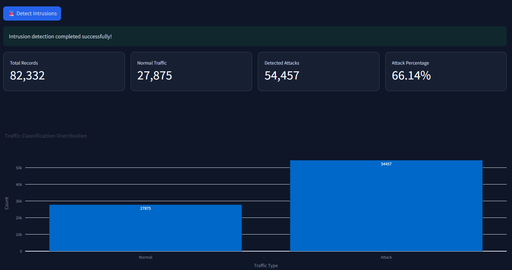
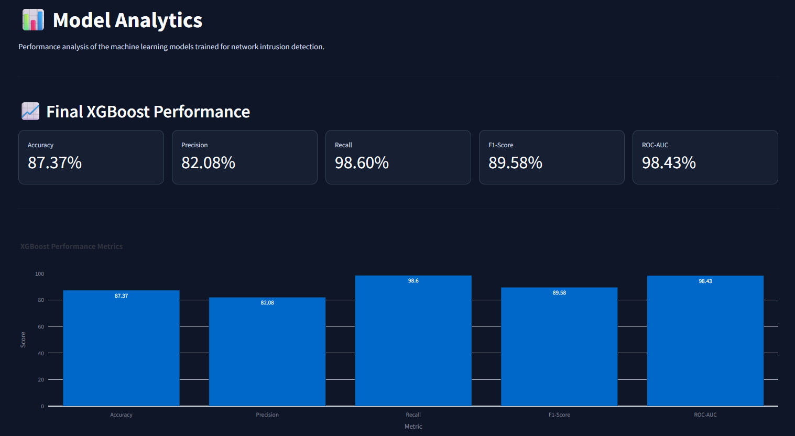
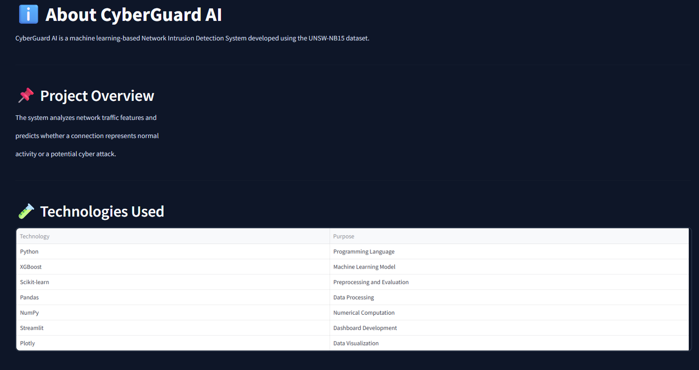

# 🛡️ CyberGuard AI
## AI-Powered Network Intrusion Detection System

[](https://cyberguard-ai-kdavjmfr6b5ewo3m9fpb7x.streamlit.app/)


---

# 🌐 Live Application

### 🚀 Try CyberGuard AI here

### **https://cyberguard-ai-kdavjmfr6b5ewo3m9fpb7x.streamlit.app/**

---

# 📌 Project Overview

CyberGuard AI is an AI-powered **Network Intrusion Detection System (NIDS)** developed using the **UNSW-NB15 dataset**. The application leverages Machine Learning to classify network traffic as either **Normal** or **Attack** traffic in real time.

Users can upload network traffic datasets through an intuitive Streamlit dashboard, visualize prediction results, analyze attack probabilities, and download the classified output.

---

# ✨ Features

- 🛡️ AI-Powered Intrusion Detection
- 📂 Upload Network Traffic CSV Files
- 🤖 XGBoost-Based Prediction Engine
- 📊 Attack Probability Estimation
- 📈 Interactive Dashboard
- 📉 Model Performance Analytics
- 📥 Download Prediction Results
- ⚡ Batch Processing for Large Datasets
- 🌐 Live Streamlit Cloud Deployment

---

# 📂 Dataset

**Dataset Used:** UNSW-NB15

| Dataset | Records |
|----------|---------|
| Training Dataset | 175,341 |
| Testing Dataset | 82,332 |

### Target Classes

- ✅ Normal Traffic
- 🚨 Attack Traffic

---

# 🧠 Machine Learning Models Evaluated

| Model | Accuracy | Precision | Recall | ROC-AUC |
|--------|----------|-----------|---------|----------|
| Logistic Regression | 80.97% | 75.35% | 97.25% | 95.58% |
| Random Forest | 87.14% | 81.74% | 98.70% | 97.91% |
| **XGBoost** | **87.37%** | **82.08%** | **98.60%** | **98.43%** |

🏆 **Final Model Selected:** **XGBoost**

---

# 📊 Dashboard Pages

### 🛡️ Security Overview

- AI Detection Pipeline
- Dataset Summary
- Model Performance
- Model Comparison

---

### 🔍 Intrusion Detection

- Upload CSV
- Detect Attacks
- Attack Probability
- Download Results

---

### 📈 Model Analytics

- Accuracy
- Precision
- Recall
- ROC-AUC
- Interactive Charts

---

### ℹ️ About Project

- Technologies Used
- Dataset Information
- Project Summary

---

# ⚙️ Technologies Used

- Python
- Streamlit
- XGBoost
- Scikit-Learn
- Pandas
- NumPy
- Plotly
- Joblib

---

# 📁 Project Structure

```text
CyberGuard-AI
│
├── Application.py
├── requirements.txt
├── README.md
│
├── models
│   ├── preprocessor.pkl
│   └── xgboost_intrusion_model.json
│
├── screenshots
│   ├── security_overview.png
│   ├── intrusion_detection.png
│   ├── prediction_results.png
│   ├── model_analytics.png
│   └── about_project.png
│
└── Dataset
```

---

# 🚀 Run Locally

```bash
git clone https://github.com/Aruna2715/CyberGuard-AI.git

cd CyberGuard-AI

pip install -r requirements.txt

streamlit run Application.py
```

---

# 📷 Application Screenshots

## 🛡️ Security Overview

<p align="center">

</p>

---

## 🔍 Intrusion Detection

<p align="center">

</p>

---

## 📊 Prediction Results

<p align="center">

</p>

---

## 📈 Model Analytics

<p align="center">

</p>

---

## ℹ️ About Project

<p align="center">

</p>

---

# 📈 Model Performance

| Metric | Score |
|---------|--------|
| Accuracy | **87.37%** |
| Precision | **82.08%** |
| Recall | **98.60%** |
| F1-Score | **89.58%** |
| ROC-AUC | **98.43%** |

---

# 🎯 Key Highlights

- ✅ End-to-End Machine Learning Project
- ✅ AI-Based Network Intrusion Detection
- ✅ Real-Time Prediction Dashboard
- ✅ Cloud Deployed using Streamlit Community Cloud
- ✅ Interactive Data Visualization
- ✅ Downloadable Prediction Reports
- ✅ Batch Processing Support
- ✅ Production-Ready User Interface

---

# 🔮 Future Enhancements

- Explainable AI using SHAP
- Deep Learning Models
- Multi-Class Attack Classification
- REST API Integration
- Live Packet Capture
- Real-Time Network Monitoring
- User Authentication

---

# 👩‍💻 Developer

## **Aruna V S**

**Machine Learning | Data Science | Artificial Intelligence**

GitHub Profile:

**https://github.com/Aruna2715**

---

# ⭐ Support

If you find this project useful, consider giving this repository a **⭐ Star**.

It helps others discover the project and support my work.

---

## 🚀 Live Demo

### https://cyberguard-ai-kdavjmfr6b5ewo3m9fpb7x.streamlit.app/
